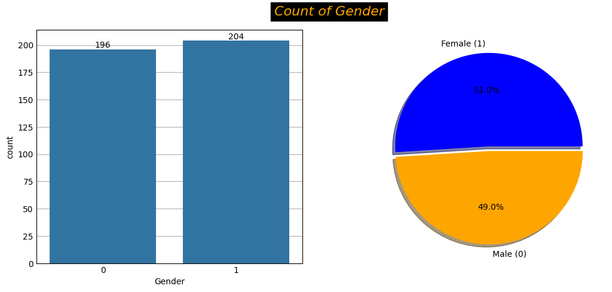
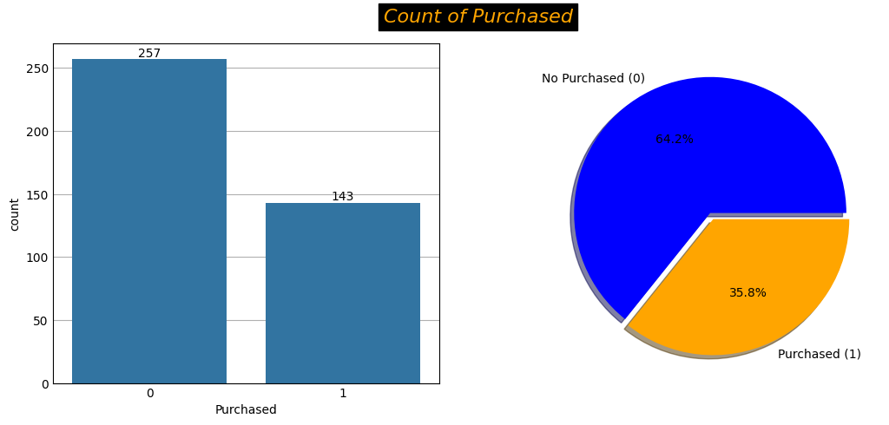
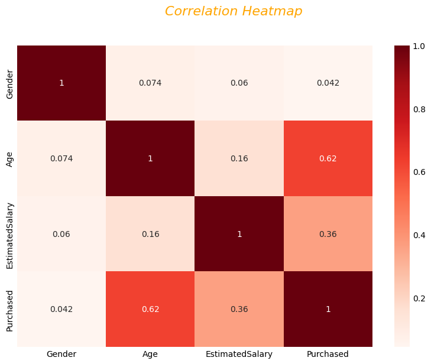
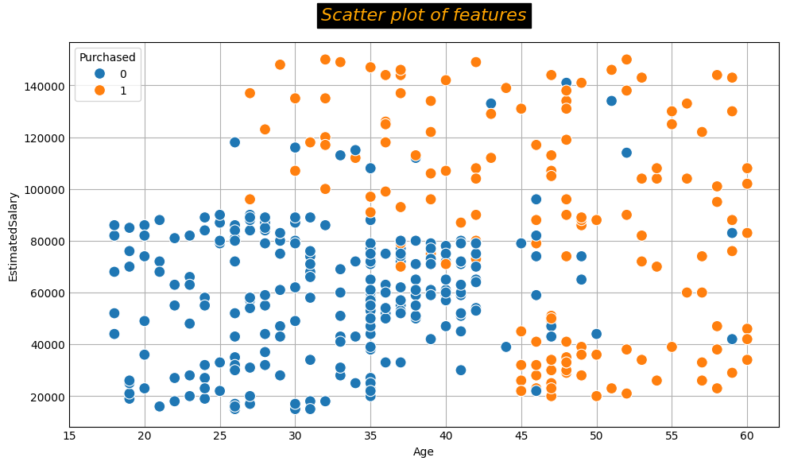
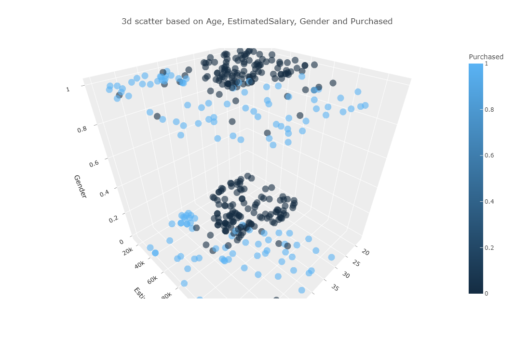

# Customer-Purchase-Prediction-Using-Machine-Learning

This project focuses on predicting customer purchasing behavior using both classical ML algorithms and deep learning models. The dataset includes customer details such as gender, age, estimated salary, visit behaviour, and user id.

# Dataset
 [datasets/Customer_Behaviour.csv](datasets/Customer_Behaviour.csv) – Raw customer behavior data used for training and evaluation.

# Features & Methods
## 1. Data Preprocessing & Cleaning

 * Dropped rows with missing values.

 * Filled missing values with the median.

 * Ensured data consistency for analysis.

## 2. Feature Correlation Analysis

## 3. Machine Learning Model

* Logistic Regression

                         Classification Report
                   precision    recall  f1-score   support

 No Purchased=0       0.92      0.97      0.94        58
   Purchased=1        0.89      0.77      0.83        22

      accuracy                            0.91        80
     macro avg        0.91      0.87      0.89        80
   weighted avg       0.91      0.91      0.91        80

Jaccard Score: 0.71

-------------------- Classification Report --------------------
                precision    recall  f1-score   support

No Purchased=0       0.92      0.97      0.94        58
   Purchased=1       0.89      0.77      0.83        22

      accuracy                           0.91        80
     macro avg       0.91      0.87      0.89        80
  weighted avg       0.91      0.91      0.91        80

Jaccard Score: 0.71

